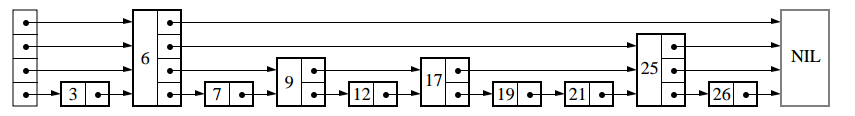
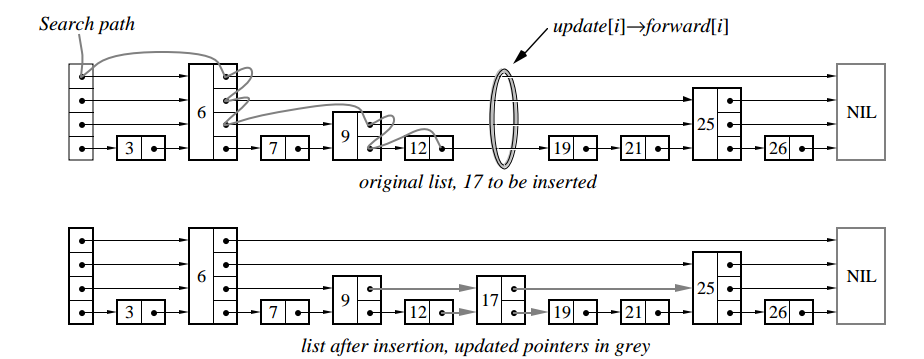

### 跳跃链表的概念
跳跃链表是有序链表的一个变种，在一个有序链表中，查找一个链表中的元素需要进行一次遍历，时间复杂度为`O(n)`，为了加快查找的过程，能够跳过某些元素呢？一个思路就是牺牲一定的空间换时间，对有序链表建立类似索引的结构加快查找过程，跳跃链表基本上就是通过维护一个多层次的链表，每一层链表中的元素是前一层链表元素的子集，搜索时，最开始在最稀疏的层次进行搜索，直至需要查找的元素在该层两个相邻元素中间，这时，将跳转到下一个层次，重复刚才的搜索，直到找到需要查找的元素为止。



[原论文Skip Lists: A Probabilistic Alternative to Balanced Trees](./skiplists.pdf)

### 跳跃链表的构建思路
如果给定一个固定的有序链表，构造跳跃链表的话，思路非常简单，就是每一层都取上一层的`1/2`个元素就可以了（例如，按奇偶，每次都取第偶数个元素作为下一层元素......），这样查找就相当于二分查找的过程，查找一个元素的时间复杂度变为了`log(n)`。但是实际应用中，有序链表往往不是固定元素个数的，会动态的增删，这种静态的构建过程就不合适了，那该怎么办呢？

可以看到，跳跃链表构建索引的关键是每一层都取上一层的部分元素作为该层的元素，即第`i`层的元素按某个固定的概率`p`（例如`1/2`或`1/4`）出现在第`i+1`层中。可通过这个概率`p`值对空间和时间进行平衡，`p`越大，占用空间越多。所以，构建的思路就是在插入一个新的元素时，随机的生成该元素的层数，算法描述如下：
```c
randomLevel()
    lvl := 1
    // random() return a random value in [0..1) 
    while random() < p && lvl < MaxLevel do
        lvl := lvl + 1
    return lvl
```
即，层次越高，概率越低，但层数也不能太高，太高了无意义，一般根据元素的个数`n`计算`MaxLevel = log(n)`作为最高层数。这样，跳跃链表就适应动态变化的情况了。

### 跳跃链表的插入、查找、删除


#### 查找
查找的思路就是先在最上层查找，找到不到再转向下一层继续查找，这样就可以跳过很多元素，缩小查找范围。算法描述如下：
```c
Search(list, searchKey)
    x := list->header  // loop invariant: x->key < searchKey
    for i := list->level downto 1 do    // downto的意思是从最高层，每次下降一层
        while x->forward[i]->key < searchKey do
            x := x->forward[i]  // x->key < searchKey <= x->forward[1]->key
    x := x->forward[1]
    if x->key = searchKey then return x->value
        else return failure
```

#### 插入
插入的关键步骤是随机决定节点层数，算法前面已经描述过，与普通链表不同的是跳跃链表是多层的，所以确定层数后每一层都需要插入该元素。


插入算法描述如下：
```c
Insert(list, searchKey, newValue)
    local update[1.. MaxLevel]
    x := list->leader
    for i:= list->level downto 1 do
        while x->forward[i]->key < searchKey do
            x := x->forward[i]  // x->key < searchKey <= x->forward[1]->key
        update[i] := x  //这里是找出这个元素在每一层的前驱节点
    x := x->forward[1]
    if x->key = searchKey then x->value := newValue
    else
        lvl := randomLevel()
        if lvl > list->level then
            for i := list->level + 1 to lvl do
                update[i] := list->header
            list->level := lvl
        x := makeNode(lvl, searchKey, value)
        for i := 1 to level do  // 这里与普通链表插入节点操作类似，只不过是每层都要插入
            x->forward[i] := update[i]->forward[i]
            update[i]->forward[i] := x 
```

#### 删除
删除操作与普通链表删除操作类似，不同的地方在于找到该元素后要每一层都做删除操作，算法描述如下：
```c
Delete(list, searchKey)
    local update[1..MaxLevel]
    x := list->header
    for i := list->level downto 1 do
        while x->forward[i]->key < searchKey do
            x := x->forward[i]
        update[i] := x
    x := x->forward[1]
    if x->key = searchKey then
        for i := 1 to list->level do
            if update[i]->forward[i] neq x then break
            update[i]->forward[i] := x->foreard[i]
        free(x)
        while list->level > 1 and list->header->forward[list->level] =NIL do 
            list->level := list->level -1
```

### [代码实现skiplist.cpp](./skiplist.cpp)
